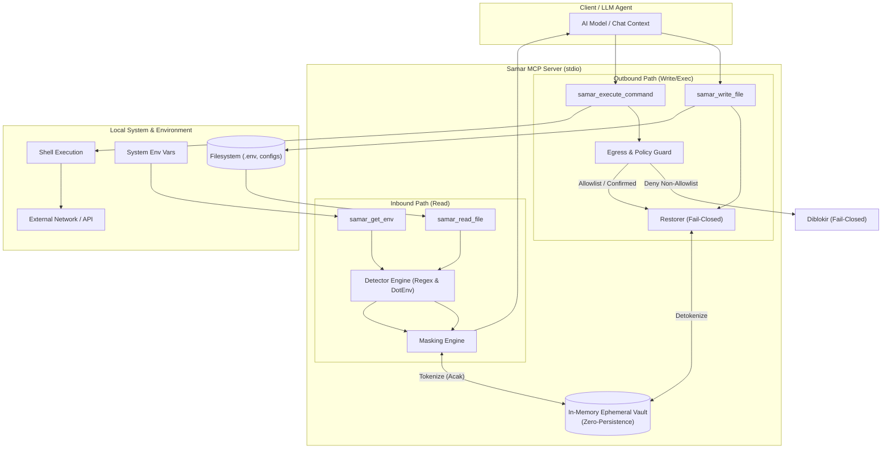

# Samar (Samar MCP Server)

[](https://github.com/hanifalkauni/samar-mcp/releases)
[](https://github.com/hanifalkauni/samar-mcp/actions/workflows/ci.yml)
[](https://golang.org)
[](./LICENSE)
[](./SECURITY.md)

[English](README.md) | **Bahasa Indonesia**

---

Privacy & security middleware MCP: masking kredensial sebelum konten mencapai
LLM (inbound), dengan vault token in-memory (zero-persistence). Rasionale desain
(historis): [`docs/PRD.md`](./docs/PRD.md) — kode adalah sumber kebenaran.

> **Status: v1.1.0** — M0 (inbound) + M1 (outbound + policy) + M2 (hardening:
> adversarial corpus, audit log, strict allowlist) + M3 (integrasi: template
> config per client, rilis binary multi-platform). Tambahan pasca-M3:
> human-in-the-loop konfirmasi (3 mode: off default / elicit / deny) dan audit
> coverage penuh (7 event). Latar belakang keputusan desain ada di
> [`docs/PRD.md`](./docs/PRD.md) (dokumen historis, tidak lagi diselaraskan —
> bila berbeda, kode yang benar).

---

## 🏗️ Alur Data & Arsitektur

*Diagram berikut mengilustrasikan alur pemrosesan inbound (sanitasi/masking rahasia dari filesystem dan env ke LLM via in-memory vault) serta pemrosesan outbound (evaluasi policy egress guard sebelum token direstorasi ke secret asli untuk penulisan file atau eksekusi perintah shell).*



---

## 📦 Instalasi

**Via `go install` (Direkomendasikan):**
```bash
go install github.com/hanifalkauni/samar-mcp/cmd/samar@latest
```

**Dari rilis:** unduh binary untuk OS/arch Anda dari `dist/` atau GitHub Releases (lihat
`SHA256SUMS.txt` untuk verifikasi), taruh di PATH, beri nama `samar`.

**Dari sumber:**
```bash
git clone https://github.com/hanifalkauni/samar-mcp.git
cd samar-mcp
go build -o samar ./cmd/samar
./samar --version
```

**Build rilis multi-platform** (linux/darwin/windows, amd64/arm64):
```powershell
pwsh scripts/build-release.ps1   # output + checksum di dist/
```

---

## 🔌 Setup Client

Template config siap pakai di [`docs/clients/`](./docs/clients/): `kiro.mcp.json`,
`cursor.mcp.json`, `claude.mcp.json`, dan `allowlist.example`. Ganti `/ABS/PATH`
dengan path binary, lalu terapkan **deny-selektif tool bawaan pada file sensitif**
(`.env`, `*.pem`, dsb.) — [`docs/CLIENT_CONFIG.md`](./docs/CLIENT_CONFIG.md).
Tanpa itu, tool bawaan client dapat membaca secret tanpa lewat masking (PRD §5.5).

---

## ✨ Fitur

### Inbound (M0)
- `samar_read_file(path)` — baca file, masking secret, kembalikan teks tersanitasi.
- `samar_get_env(env_var?)` — baca environment dengan value termasking (nama variabel tetap terlihat).

### Outbound (M1)
- `samar_write_file(path, content)` — restorasi token → secret asli sebelum ditulis; **abort** bila token korup/terpotong (fail-closed).
- `samar_execute_command(command, cwd?)` — evaluasi policy exfiltration **sebelum** unmask; unmask lalu jalankan; output di-mask ulang.
- **Policy exfiltration (§5.6):** token yang mengalir ke host eksternal non-allowlist → eksekusi diblokir (fail-closed).
- **Egress allowlist bertingkat (§13.3):** `global ∪ per-project`, lazy reload tanpa restart (§13.5).

### Inti
- Vault token↔secret dua-arah, in-memory, token **acak** (bukan hash nilai) + reverse-map determinisme.
- Detektor: parser `.env*` (mask semua value) + rule-set regex (AWS, GitHub, OpenAI, Slack, Stripe, Google, JWT, DB URI, private key, variabel generik).

---

## ⚙️ Variabel Lingkungan

| Variabel | Opsi / Nilai | Default | Deskripsi |
| :--- | :--- | :--- | :--- |
| `SAMAR_STRICT_ALLOWLIST` | `1` / `0` | `0` (union) | Jika `1`, egress allowlist per-project mempersempit global (`global ∩ project`). Default: penggabungan (`global ∪ project`). (Dukungan mundur: `SAFEENV_STRICT_ALLOWLIST`). |
| `SAMAR_REQUIRE_CONFIRM` | `""`, `"off"`, `"elicit"`, `"deny"` | `""` (off) | Kontrol konfirmasi manusia saat perintah jaringan mengirim secret:<br>• `""` / `"off"`: auto-approve jika host terdaftar di allowlist (peringatan dicetak ke stderr).<br>• `"elicit"`: minta persetujuan interaktif via MCP elicitation (fail-closed bila tidak didukung client).<br>• `"deny"`: selalu tolak aksi jaringan bertoken.<br>(Dukungan mundur: `SAFEENV_REQUIRE_CONFIRM`). |

---

## 🏛️ Arsitektur (SOLID)

Setiap lapisan bergantung ke **interface**, bukan tipe konkret; implementasi
dirakit hanya di `cmd/samar/main.go`.

```text
cmd/samar              composition root — wiring satu-satunya
internal/vault         penyimpanan secret↔token in-memory (SRP)
internal/idgen         TokenGenerator berbasis crypto/rand
internal/detector      Detector interface + Registry (ISP, OCP) + dotenv & regex
internal/masking       Engine: detect→tokenize→replace, bergantung abstraksi (DIP)
internal/restore       Restorer: token→secret, fail-closed pada token korup (M1)
internal/policy        Policy exfiltration/confused-deputy, fail-closed (M1)
internal/allowlist     Egress allowlist bertingkat + lazy reload (M1)
internal/safeio        abstraksi FileReader/EnvReader/FileWriter/CommandRunner (DIP)
internal/server        registrasi & handler 4 tool MCP, bergantung interface
```

---

## 📂 Struktur Repositori

```text
samar-mcp/
├── cmd/
│   └── samar/               # Composition root & entry point binary MCP
├── internal/
│   ├── allowlist/           # Multi-layer egress allowlist & lazy reload
│   ├── audit/               # Audit logger JSONL dengan HMAC / hash-chaining
│   ├── detector/            # Scanner kredensial (DotEnv parser & Regex rules)
│   ├── idgen/               # Generator ID token acak (crypto/rand)
│   ├── masking/             # Engine sanitasi inbound (detect -> tokenize -> replace)
│   ├── policy/              # Evaluasi egress exfiltration & confused-deputy guard
│   ├── restore/             # Engine unmask outbound dengan fail-closed verification
│   ├── safeio/              # Abstraksi I/O (FileReader, EnvReader, CommandRunner)
│   ├── server/              # Registrasi dan handler 4 tool MCP
│   └── vault/               # Penyimpanan dua-arah secret ↔ token in-memory
├── docs/
│   ├── clients/             # Template konfigurasi client (Kiro, Cursor, Claude)
│   ├── BYPASS_TEST.md       # Prosedur uji pencegahan bypass manual
│   ├── CLIENT_CONFIG.md     # Panduan setup deny-selektif tool bawaan client
│   └── PRD.md               # Dokumen historis rasionale desain (frozen)
├── scripts/                 # Skrip otomasi build rilis multi-platform
└── test/
    └── canary/              # Canary test harness untuk verifikasi batas proteksi
```

---

## 🧪 Build & Test

```bash
go build -o bin/samar ./cmd/samar       # binary
go test -race ./...                      # unit test + race detector
go vet ./...
```

**Canary harness** — buktikan batas proteksi secara konkret (tanam penanda unik
di berbagai jenis file, jalankan tool Samar via MCP, pastikan nol kebocoran
tak terduga):
```bash
go build -o bin/samar ./cmd/samar
go run ./test/canary        # exit 0 = tak ada kebocoran tak terduga
```
Harness melaporkan per-fixture `PROTECTED` / `EXPECTED-LEAK` (batas desain) /
`UNEXPECTED-LEAK`. **Catatan:** ini membuktikan masking pada jalur yang MELEWATI
Samar (Lapis 1) — bukan bahwa client tak bisa membaca file lewat tool
bawaannya (Lapis 2 / bypass). Untuk menguji bypass di client nyata, ikuti
[`docs/BYPASS_TEST.md`](./docs/BYPASS_TEST.md) (prosedur canary manual per client).

---

## 🚀 Pemakaian

Tambahkan Samar ke konfigurasi MCP IDE/Client Anda (misalnya `~/.gemini/config/mcp_config.json`, `.kiro/settings/mcp.json`, `.cursor/mcp.json`, atau Claude Desktop `claude_desktop_config.json`):

#### Opsi 1: Otomatis via `go run` (Tanpa Instalasi Manual)
Menjalankan Samar secara on-the-fly langsung dari repositori GitHub:
```json
{
  "mcpServers": {
    "samar": {
      "command": "go",
      "args": ["run", "github.com/hanifalkauni/samar-mcp/cmd/samar@latest"]
    }
  }
}
```

#### Opsi 2: Binary Terpasang di PATH
Jika Anda sudah memasang Samar via `go install` atau meletakkan binary di PATH sistem:
```json
{
  "mcpServers": {
    "samar": {
      "command": "samar",
      "args": []
    }
  }
}
```

#### Opsi 3: Path Binary Lokal
Jika menjalankan dari hasil build lokal atau direktori kustom:
```json
{
  "mcpServers": {
    "samar": {
      "command": "/path/to/samar",
      "args": []
    }
  }
}
```

> **Syarat Mutlak:** Terapkan **deny-selektif pada tool bawaan client untuk file sensitif** (`.env`, `*.pem`, dsb.) — lihat panduan [`docs/CLIENT_CONFIG.md`](./docs/CLIENT_CONFIG.md). Tanpa langkah ini, tool bawaan client dapat membaca secret langsung tanpa masking (PRD §5.5). Template konfigurasi siap pakai per client tersedia di [`docs/clients/`](./docs/clients/).

---

## 🔒 Keamanan

- **Zero-Persistence:** Vault strictly in-memory; hangus seketika saat proses berhenti. Tidak ada tool untuk unmask dari sisi LLM.
- **Anti-Brute Force:** Token acak tidak diturunkan dari nilai asli (bukan hash).
- **DoS Guard:** File berukuran > 10 MB ditolak dengan error terkontrol.

---

## ❓ FAQ & Troubleshooting

<details>
<summary><b>Bagaimana jika token placeholder termutasi atau terpotong oleh LLM?</b></summary>

Samar menerapkan prinsip **fail-closed**. Jika model AI memotong token (misal `__SAMAR_SEC...` bukan token utuh yang valid), `samar_write_file` dan `samar_execute_command` akan langsung membatalkan operasi (*abort*) dan mengembalikan error demi mencegah penulisan data korup atau secret yang rusak.
</details>

<details>
<summary><b>Mengapa AI masih bisa membaca nilai asli di file .env saya?</b></summary>

Pastikan Anda telah menerapkan **deny-selektif** pada tool bawaan client AI (seperti `fs_read` atau `Read`). Jika client memanggil tool baca bawaannya, konten dibaca langsung tanpa melewati Samar. Lihat panduan lengkap di [`docs/CLIENT_CONFIG.md`](./docs/CLIENT_CONFIG.md).
</details>

<details>
<summary><b>Apakah perlu me-restart server Samar saat memperbarui file allowlist?</b></summary>

Tidak. Samar mengimplementasikan *lazy reload* otomatis (interval 5 detik berdasarkan `mtime` file) pada file allowlist global (`~/.samar/allowlist`) maupun per-project (`./.samar/allowlist`).
</details>

<details>
<summary><b>Apakah secret asli ikut dicatat ke dalam log audit?</b></summary>

Tidak. Log audit disimpan di `.samar/audit/<timestamp>.jsonl` dengan HMAC/hash-chain anti-tamper. Log ini hanya mencatat metadata event (tipe event, nama tool, keputusan policy, alasan, dan aktor), tidak pernah mencatat secret mentah.
</details>

## 🤝 Kontribusi & Keamanan

- **Kontribusi**: Panduan pengembangan lokal, alur pengujian, dan pedoman pull request tersedia di [CONTRIBUTING.md](./CONTRIBUTING.md).
- **Kebijakan Keamanan**: Prosedur pelaporan kerentanan dan cakupan threat model dapat dilihat di [SECURITY.md](./SECURITY.md).

---

## 📄 Lisensi

SPDX-License-Identifier: MIT

Proyek ini dilisensikan di bawah [MIT License](./LICENSE).
