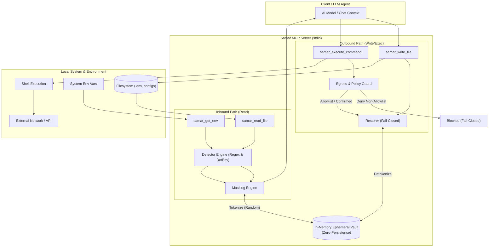

# Samar (Samar MCP Server)

[](https://github.com/hanifalkauni/samar-mcp/releases)
[](https://github.com/hanifalkauni/samar-mcp/actions/workflows/ci.yml)
[](https://golang.org)
[](./LICENSE)
[](./SECURITY.md)

**English** | [Bahasa Indonesia](README.id.md)

---

Privacy & security middleware for the Model Context Protocol (MCP). Samar intercepts and masks sensitive credentials (API keys, passwords, private keys, database URLs, and `.env` variables) before they reach the LLM context (inbound), replacing them with deterministic reversible tokens backed by an in-memory ephemeral vault (zero-persistence). Outbound operations (file writes and command executions) safely restore tokens to real values while enforcing strict egress allowlists and fail-closed policies.

> **Version: v1.1.0** — Production-ready privacy middleware featuring inbound credential masking, fail-closed outbound restoration, network egress policy enforcement, human-in-the-loop confirmation (`off`, `elicit`, `deny`), and cryptographic HMAC audit logging.

---

## 🏗️ Data Flow & Architecture

*The following diagram illustrates the inbound path (sanitizing/masking secrets from local filesystem and environment variables before reaching LLM context via an in-memory vault) and outbound path (evaluating egress policy guard before unmasking tokens back to raw secrets for file writes or command execution).*



---

## 📦 Installation

**Via `go install` (Recommended):**
```bash
go install github.com/hanifalkauni/samar-mcp/cmd/samar@latest
```

**From release:** download the binary for your OS/architecture from `dist/` or GitHub Releases (refer to
`SHA256SUMS.txt` for verification), place it in your `PATH`, and name it `samar`.

**From source:**
```bash
git clone https://github.com/hanifalkauni/samar-mcp.git
cd samar-mcp
go build -o samar ./cmd/samar
./samar --version
```

**Build multi-platform releases** (linux/darwin/windows, amd64/arm64):
```powershell
pwsh scripts/build-release.ps1   # outputs and checksums in dist/
```

---

## 🔌 Client Setup

Ready-to-use configuration templates are provided in [`docs/clients/`](./docs/clients/):
`kiro.mcp.json`, `cursor.mcp.json`, `claude.mcp.json`, and `allowlist.example`.
Replace `/ABS/PATH` with your binary path, then apply **selective-deny on built-in tools for sensitive files**
(`.env`, `*.pem`, etc.) — see [`docs/CLIENT_CONFIG.md`](./docs/CLIENT_CONFIG.md).
Without this step, built-in client tools can bypass Samar and read secrets directly (PRD §5.5).

---

## ✨ Features

### Inbound (M0)
- `samar_read_file(path)` — reads local file, masks sensitive secrets, returns sanitized content.
- `samar_get_env(env_var?)` — reads environment variables with masked values (variable keys remain visible).

### Outbound (M1)
- `samar_write_file(path, content)` — restores tokens back to original secrets before writing; **aborts** if tokens are corrupted or truncated (fail-closed).
- `samar_execute_command(command, cwd?)` — evaluates exfiltration policy **prior** to unmasking; unmasks and executes command; re-masks command output.
- **Exfiltration policy (§5.6):** tokens destined for external hosts not on the allowlist are blocked (fail-closed).
- **Multi-layer egress allowlist (§13.3):** `global ∪ per-project`, hot lazy-reloading without restarts (§13.5).

### Core Engine
- Two-way in-memory token↔secret vault, using **cryptographically random** tokens (not value hashes) with reverse-mapping for session determinism.
- Detectors: `.env*` parser (masks all values) + regex rule-set (AWS, GitHub, OpenAI, Slack, Stripe, Google, JWT, database URIs, private keys, generic assignments).

---

## ⚙️ Environment Variables

| Variable | Values / Options | Default | Description |
| :--- | :--- | :--- | :--- |
| `SAMAR_STRICT_ALLOWLIST` | `1` / `0` | `0` (union) | When set to `1`, per-project allowlist narrows the global allowlist (`global ∩ project`). Default: union merge (`global ∪ project`). (Backward-compatible fallback: `SAFEENV_STRICT_ALLOWLIST`). |
| `SAMAR_REQUIRE_CONFIRM` | `""`, `"off"`, `"elicit"`, `"deny"` | `""` (off) | Human-in-the-loop confirmation before outbound network calls containing unmasked secrets:<br>• `""` / `"off"`: auto-approve if destination host is in allowlist (warning logged to stderr).<br>• `"elicit"`: request interactive approval via MCP elicitation (fail-closed if client lacks support).<br>• `"deny"`: reject all network commands containing tokens.<br>(Backward-compatible fallback: `SAFEENV_REQUIRE_CONFIRM`). |

---

## 🏛️ Architecture (SOLID)

Every component depends on **interfaces**, not concrete types; implementations are wired strictly in `cmd/samar/main.go`.

```text
cmd/samar              composition root — sole dependency wiring location
internal/vault         in-memory secret↔token storage (SRP)
internal/idgen         TokenGenerator backed by crypto/rand
internal/detector      Detector interface + Registry (ISP, OCP) + dotenv & regex
internal/masking       Masking Engine: detect→tokenize→replace, depends on abstractions (DIP)
internal/restore       Restorer: token→secret, fail-closed on corrupt tokens (M1)
internal/policy        Exfiltration & confused-deputy policy, fail-closed (M1)
internal/allowlist     Layered egress allowlist + hot lazy reload (M1)
internal/safeio        FileReader/EnvReader/FileWriter/CommandRunner abstractions (DIP)
internal/server        MCP tool registration & dispatch handlers (DIP)
```

---

## 📂 Repository Structure

```text
samar-mcp/
├── cmd/
│   └── samar/               # Composition root & MCP binary entry point
├── internal/
│   ├── allowlist/           # Multi-layer egress allowlist & lazy reload
│   ├── audit/               # JSONL audit logger with HMAC / hash-chaining
│   ├── detector/            # Secret scanner (DotEnv parser & Regex rulesets)
│   ├── idgen/               # Random token ID generator (crypto/rand)
│   ├── masking/             # Inbound sanitization engine (detect -> tokenize -> replace)
│   ├── policy/              # Egress exfiltration guard & confused-deputy policy
│   ├── restore/             # Outbound unmask engine with fail-closed integrity checks
│   ├── safeio/              # I/O abstractions (FileReader, EnvReader, CommandRunner)
│   ├── server/              # MCP tool registration and request handlers
│   └── vault/               # Two-way in-memory secret ↔ token store
├── docs/
│   ├── clients/             # Pre-configured client configs (Kiro, Cursor, Claude)
│   ├── BYPASS_TEST.md       # Manual canary bypass-prevention testing guide
│   ├── CLIENT_CONFIG.md     # Setup guide for selective-deny on built-in tools
│   └── PRD.md               # Historical design rationale document (frozen)
├── scripts/                 # Multi-platform release build automation scripts
└── test/
    └── canary/              # Canary test harness verifying masking boundaries
```

---

## 🧪 Build & Test

```bash
go build -o bin/samar ./cmd/samar       # compile binary
go test -race ./...                      # unit tests with race detector
go vet ./...
```

**Canary harness** — concretely verifies protection boundaries (plants unique markers across diverse file types, exercises Samar tools via MCP, and verifies zero unexpected leaks):
```bash
go build -o bin/samar ./cmd/samar
go run ./test/canary        # exit 0 = no unexpected leaks
```
The harness reports `PROTECTED` / `EXPECTED-LEAK` (design limits) / `UNEXPECTED-LEAK` per fixture. **Note:** this validates masking on requests that PASS THROUGH Samar (Layer 1) — not that the client cannot read files using its built-in tools (Layer 2 / bypass). To test bypass prevention on actual clients, follow [`docs/BYPASS_TEST.md`](./docs/BYPASS_TEST.md).

---

## 🚀 Usage

Add Samar to your IDE/Client MCP configuration (e.g., `~/.gemini/config/mcp_config.json`, `.kiro/settings/mcp.json`, `.cursor/mcp.json`, or Claude Desktop `claude_desktop_config.json`):

#### Option 1: Automatic via `go run` (Zero Installation)
Runs Samar on-the-fly directly from the GitHub repository:
```json
{
  "mcpServers": {
    "samar": {
      "command": "go",
      "args": ["run", "github.com/hanifalkauni/samar-mcp/cmd/samar@latest"]
    }
  }
}
```

#### Option 2: Pre-installed Binary (in PATH)
If you installed Samar via `go install` or placed the binary in your PATH:
```json
{
  "mcpServers": {
    "samar": {
      "command": "samar",
      "args": []
    }
  }
}
```

#### Option 3: Local Binary Path
If running from a local build or custom directory:
```json
{
  "mcpServers": {
    "samar": {
      "command": "/path/to/samar",
      "args": []
    }
  }
}
```

> **Crucial Requirement:** Enforce **selective-deny on built-in tools for sensitive files** (`.env`, `*.pem`, etc.) — see [`docs/CLIENT_CONFIG.md`](./docs/CLIENT_CONFIG.md). Without this step, client built-in tools can bypass Samar and read secrets directly (PRD §5.5). Ready-to-use templates for specific clients are available in [`docs/clients/`](./docs/clients/).

---

## 🔒 Security Model

- **Zero-Persistence:** Vault is strictly in-memory; completely destroyed upon process termination. No MCP tool exists to unmask values from the LLM side.
- **Anti-Brute Force:** Random tokens do not leak original secret contents or hashes.
- **DoS Guard:** Files exceeding 10 MB are rejected with controlled error handling.

---

## ❓ FAQ & Troubleshooting

<details>
<summary><b>What happens if an LLM truncates or corrupts a secret token?</b></summary>

Samar enforces a strict **fail-closed** policy. If an AI model mutates or truncates a placeholder token (e.g. `__SAMAR_SEC...` instead of a known valid token), `samar_write_file` and `samar_execute_command` immediately abort the operation and return an error to prevent file corruption or broken secrets.
</details>

<details>
<summary><b>Why can my AI assistant still read raw secrets from my .env file?</b></summary>

Ensure you have configured **selective-deny** on your AI client's built-in file reading tools (such as `fs_read` or `Read`). If the AI invokes its native read tool, files are read directly without passing through Samar. Follow the setup instructions in [`docs/CLIENT_CONFIG.md`](./docs/CLIENT_CONFIG.md).
</details>

<details>
<summary><b>Do I need to restart Samar when modifying the allowlist?</b></summary>

No. Samar utilizes automatic *hot lazy reloading* (checked every 5 seconds via file `mtime`) for both global (`~/.samar/allowlist`) and project-level (`./.samar/allowlist`) allowlists.
</details>

<details>
<summary><b>Are raw secrets recorded in the audit logs?</b></summary>

No. Session audit logs in `.samar/audit/<timestamp>.jsonl` are cryptographically chained (HMAC/hash-chain). They only record event metadata (event type, tool name, policy decision, reason, actor, and token identifier) — raw secrets are never written.
</details>

## 🤝 Contributing & Security

- **Contributing**: Please review [CONTRIBUTING.md](./CONTRIBUTING.md) for local development guidelines, testing workflows, and pull request procedures.
- **Security Policy**: For vulnerability disclosure and security scope, refer to [SECURITY.md](./SECURITY.md).

---

## 📄 License

SPDX-License-Identifier: MIT

This project is licensed under the [MIT License](./LICENSE).
